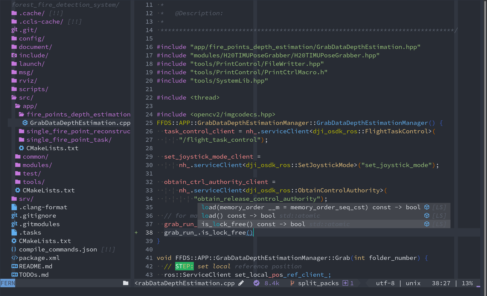

# 

> Due to my study and work, I always want to use vim under different environments. So, I always choose the plugins with
> good compatibility. In my opinion, I prefer the plugins written in `vimscripts > vimscripts + python3 > lua`.Comparing
> with today's neovim lua trending, The plugins in this configuration are pretty "**Old-School**"!

**In this vim/neovim configuration, I tried to:**

- choose and config the plugins with good compatibility, which can work under `Linux (x86_64, aarch64)`,
  `Windows (x86_64)` and even `git bash`.
- use as less dependences as possible to accomplish the functions.
- keep the original vim keybindings and operations.
- use `dein.vim` to lazy load most of the plugins.
- daily update.

## Requirements

### Vim & Neovim Version (recommend)

- vim 8 if use `Ulti-Mode`, vim 7 if use `Mini-Mode`
- neovim 4.2 or later, no matter what modes.

## Quick Start

- take a reference or just use the `config_env.sh` to install the dependencies...

- **Mini-Mode:** set `g:osv_ulti_mode` to `0` in [mode_control.vim](./mode_control.vim)

  > use vim as an excellent text editor!

  - Zero dependencies.
  - Fully portable.
  - Pure vimscripts.

- **Ulti-Mode** set `g:osv_ulti_mode` to `1` in [mode_control.vim](./mode_control.vim)

  - `g:osv_plug_general = 1`

    - general editor enhancement plugins.

  - `g:osv_plug_advanced = 1`

    - file type based special plugins.

  - `g:osv_plug_coc = 1`

    - use `coc.nvim` as `lsp + completion engine` and much more.

  - choose **one** from `completion engine`:

    - `g:osv_plug_deoplete`
    - `g:osv_plug_asyncomplete`

  - `g:osv_plug_lsp = 1`
    - language-sever based code completion, etc.

## Installation

### Before Installation

**NOTE:**

  - 🆘 using `Anaconda3` instead of the system default `python` may cause problems with python path and `pynvim`
    installation. Under this situation, tweaking manually may be needed.

  - the support of `coc.nvim` on `aarch64` is not good, try to avoid this.

### Installation Steps

0. **the dependences:**

   - `python 3`, if `g:osv_plug_advanced = 1` or `g:osv_plug_deoplete = 1`
   - `nodejs`, if `g:osv_plug_coc = 1`
   - some language servers (clangd, ccls, pyright etc.), if `g:osv_plug_lsp = 1` or `g:osv_plug_coc = 1`
   - You can also use the bash files under the `env/` folder.

1. **clone the repo to the path:**
   - **For Windows:**
     - Neovim configuration path: `~/Appdata/Local/nvim`
     - Vim configuration path(For Git Bash): `~/.vim`
     - Gvim configuration path: `~/vimfiles`
   - **For Linux:**
     - Neovim configuration path: `~/.config/nvim`
     - Vim configuration path: `~/.vim`

2. **choose your mode** with the global variables defined in [mode_control.vim](./mode_control.vim)

3. open vim/nvim and wait for the `dein` to install all the plugins.
   - `:UpdateRemotePlugins` may also needed for nvim.

4. restart vim/nvim

## Screen Shots

### Mini-Mode

| **Environment**                                                          | **Screen Shots**               |
| ------------------------------------------------------------------------ | ------------------------------ |
| <kbd>Ubuntu 18.04</kbd> + <kbd>Vim 8.2</kbd> + <kbd>Xfce4-terminal</kbd> |  |
| <kbd>Windows 10</kbd> + <kbd>Neovim 5.0</kbd> + <kbd>Alacritty</kbd>     |    |

### Ulti-Mode & Advanced Features h

**NOTE:** Please notice that the Gvim on Windows will confuse the Git Bash with
its own vim.

| **Environment**                                                          | **Screen Shots**                      |
| ------------------------------------------------------------------------ | ------------------------------------- |
| <kbd>Ubuntu 20.04</kbd> + <kbd>Vim 8.1</kbd> + <kbd>Xfce4-terminal</kbd> |  |

## Keymaps

### File Explorer

`<leader>t`: toggle file explorer

| keys    | functions                                            |
| ------- | ---------------------------------------------------- |
| `j, k`  | up and down                                          |
| `h, l`  | left and right, but collapse or expand the tree node |
| `mt`    | toggle mark (select) multiple items                  |
| `mn`    | next mark item                                       |
| `mp`    | prev mark item                                       |
| `ma`    | toggle mark (select) all                             |
| `mc`    | clear mark (select) all                              |
| `mv`    | mark (select) items move                             |
| `J, K`  | toggle mark (select) multiple items with move        |
| `H, L`  | collapse all (recursively), expand all (recursively) |
| `q`     | quit                                                 |
| `<CR>`  | open file or cd to the direcory                      |
| `<BS>`  | cd to the parent directory                           |
| `<TAB>` | action                                               |
| `e`     | split and open                                       |
| `o`     | toggle open tree                                     |
| `v`     | vsplit and open                                      |
| `t`     | new tab and open                                     |
| `if`    | show info of the item                                |
| `ip`    | preview                                              |
| `yP`    | copy abs file path (different details)               |
| `yp`    | copy relative file path                              |
| `yy`    | copy file(s)                                         |
| `yn`    | copy file name                                       |
| `dd`    | cut file(s)                                          |
| `p`     | paste file(s)                                        |
| `df`    | delete/trash file(s)                                 |
| `dF`    | delete/trash file(s), force or forever               |
| `a`     | add file(s), maybe path with "/"                     |
| `A`     | add directory(s)                                     |
| `rn`    | rename only name (or the normal one)                 |
| `rN`    | rename with extension                                |
| `rp`    | rename with abs path                                 |
| `fs`    | start filter                                         |
| `fc`    | clear filter                                         |
| `sc`    | change sort                                          |
| `sr`    | reverse sort                                         |
| `st`    | sort by time                                         |
| `sn`    | sort by filename                                     |
| `ss`    | sort by size                                         |
| `se`    | sort by extension                                    |
| `<C-r>` | redraw/refresh                                       |
| `<C-h>` | toggle hidden items                                  |
| `<C-i>` | toggle gitignore items                               |
| `.`     | toggle dot items                                     |
| `xv`    | execute vim cmd                                      |
| `xs`    | system execute                                       |
| `?`     | help                                                 |
| `cp`    | clipboard print (show)                               |
| `cc`    | clipboard clear                                      |
| `b`     | book mark operation                                  |
| `/`     | search                                               |
| `gg`    | first item (in all or in the sibling)                |
| `G`     | last item (in all or in the sibling)                 |
| `gp`    | git prev                                             |
| `gp`    | git prev                                             |
| `gn`    | git next                                             |
| `gr`    | git reload                                           |
| `gs`    | git stage                                            |
| `gS`    | git unstage                                          |
| `[d`    | diagnostic prev                                      |
| `]d`    | diagnostic next                                      |
| `zr`    | jump root                                            |
| `zp`    | jump parent                                          |
| `zh`    | jump home                                            |
| `z`     | jump move                                            |
| `wl`    | disk / drive list                                    |

> Last Modified : 三 19 4月 2023 09:43:35 下午
