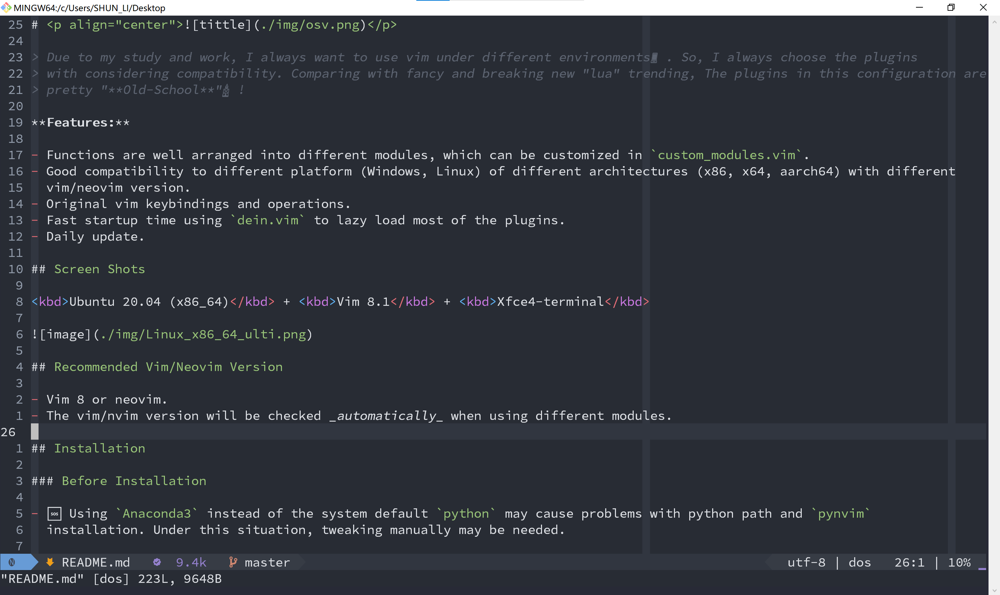

# 

<b>Old-school Vim/Neovim Configuration.</b>

**Features:**

- 🏫Old-school configuration in vimscripts.
- 🔌Functions are well arranged into different modules, which can be customized in `custom_modules.vim`.
- 🤖Good compatibility to different platform (Windows, Linux) of different architectures (x86, x64, aarch64) with different
  vim/neovim versions.
- 🌟Stay in original vim keybindings and operations, but add some meaningful keybindings.
- ⚡Fast startup time using `dein.vim` to lazy load most of the plugins.
- 🆙 Daily update support.

## 
 Screen Shots📺 

<kbd>Ubuntu 20.04 (x86_64)</kbd> + <kbd>Vim 8.1</kbd> + <kbd>Xfce4-terminal</kbd>

<kbd>Win10</kbd> + <kbd>Vim 9</kbd> + <kbd>git bash </kbd>

## 
 Vim/Neovim Version 🎯

> The vim/nvim version will be checked _automatically_ when using different modules.

- Vim 8 or higher, at least 7.4.
- Neovim 0.4.2 or higher.

## 
 Installation ⬇ 

### Before Installation

- 🆘 Using `Anaconda3` instead of the system default `python` may cause problems with python path and `pynvim`
  installation. Under this situation, tweaking manually may be needed.

### Installation Steps

0. **Optional dependences:**

   **NOTE:** Take a reference or just use the `config_env.sh` to install the dependencies...

   - `has('python3')` (if using the advanced plugins.).
   - rg, ag for finders (fzf, leaderf, clap and ctrlp).
   - some language servers for `coc.nvim`, `vim-lsc`, `vim-lsp`.
   - `nodejs` for `coc.nvim`.

1. **Clone the repo to the path:**

   - **For Windows:**
     - Neovim configuration path: `~/Appdata/Local/nvim`
     - Vim configuration path(For Git Bash): `~/.vim`
     - Gvim configuration path: `~/vimfiles`
   - **For Linux:**
     - Neovim configuration path: `~/.config/nvim`
     - Vim configuration path: `~/.vim`

2. **Choose your modules** with the global variables defined in `custom_modules.vim`

   - This `custom_modules.vim` is generated _automatically_ after installation.

3. Open vim/nvim and wait for the `dein` to install all the plugins.

   - `:call dein#recache_runtime_path()` to refresh the runtime path.
   - `:UpdateRemotePlugins` may also needed for nvim.

4. Restart vim/nvim

## 
 Quick Start🚀 

⌨Use the `custom_modules.vim` in the configuration path to manage the functional modules in OSV.

- **`g:osv_warning`**

  > print the warning message when OSV starts.

  - **type:** int
  - **possible values:** `0` and `1`

- **`g:osv_plug_general`**

  > use some general editor enhancement plugins, zero dependencies, and pure vimscripts.

  - **type:** int
  - **possible values:** `0` and `1`

- **`g:osv_plug_advanced`**

  > file type based plugins, may also needs some dependences.

  - **type:** int
  - **possible values:** `0` and `1`

- **`g:osv_finder`**

  > choose one of fidners to find files, buffers, and more.

  - **type:** string
  - **possible values:** `coc-lists`, `fzf`, `leaderf`, `clap` and `ctrlp`.
  - **note:**
    - `coc-lists` needs the `coc` as the complete engine.
    - need `ag` and `rg` for searching.
    - set to `none` to disable.

- **`g:osv_file_explorer`**

  > choose one of the file explorers to arrange files

  - **type:** string
  - **possible values:** `coc-explorer`, `fern`, `defx` and `vimfiler`.
  - **note:**
    - `coc-explorer` needs the `coc` as the completion engine.
    - set to `none` to disable.

- **`g:osv_complete_engine`**

  > choose one of the complete framework to provide automatic completion.

  - **type:** string
  - **possible values:** `coc`, `deoplete`, `asyncomplete`, and `mucomplete`
  - **note:**
    - set to `none` to disable.

- **`g:osv_linter`**

  > choose one backend of the linter

  - **type:** string
  - **possible values:** `ale`
  - **note:**
    - set to `none` to disable.

- **`g:osv_lsp`**

  > choose one backend of the lsp

  - **type:** string
  - **possible values:** `vim-lsp`, `lcn`, and `vim-lsc`
  - **note:**
    - set to `none` to disable.

## 
 Keymap 🗺 

### Finders🔍

#### Invoke the finders

`<leader>f+<keys>`: toggle finder with:

| keys | functions                                  |
| ---- | ------------------------------------------ |
| `b`  | find buffers                               |
| `d`  | find diagnostic                            |
| `f`  | find files                                 |
| `j`  | find jumplist                              |
| `l`  | find lines (current or the active buffers) |
| `m`  | find frequency (mru)                       |
| `n`  | find notice (messages)                     |
| `o`  | find old files (file history)              |
| `p`  | find projects                              |
| `r`  | find register                              |
| `s`  | find sessions                              |
| `t`  | find templates                             |
| `u`  | find undo                                  |
| `w`  | find word                                  |
| `W`  | find previous word                         |
| `y`  | find yank                                  |
| `q`  | find location list                         |
| `Q`  | find quickfix list                         |
| `c`  | find change                                |
| `a`  | list all of the providers, pickers         |
| `k`  | find function entrance                     |
| `p`  | resume previous providers, pickers         |

#### In the finder buffer

##### Insert mode

| keys    | functions     |
| ------- | ------------- |
| `<C-j>` | next item     |
| `<C-k>` | previous item |
| `<CR>`  | confirm       |

##### Normal mode

TODO:

### File Explorer📁

#### Invoke file explorer

`<leader>t`: toggle file explorer

#### In the file explorer buffer

| keys    | functions                                            |
| ------- | ---------------------------------------------------- |
| `j, k`  | up and down                                          |
| `h, l`  | left and right, but collapse or expand the tree node |
| `mt`    | toggle mark (select) multiple items                  |
| `mn`    | next mark item                                       |
| `mp`    | prev mark item                                       |
| `ma`    | toggle mark (select) all                             |
| `mc`    | clear mark (select) all                              |
| `mv`    | mark (select) items move                             |
| `J, K`  | toggle mark (select) multiple items with move        |
| `H, L`  | collapse all (recursively), expand all (recursively) |
| `q`     | quit                                                 |
| `<CR>`  | open file or cd to the direcory                      |
| `<BS>`  | cd to the parent directory                           |
| `<TAB>` | action                                               |
| `e`     | split and open                                       |
| `o`     | toggle open tree                                     |
| `v`     | vsplit and open                                      |
| `t`     | new tab and open                                     |
| `if`    | show info of the item                                |
| `ip`    | preview                                              |
| `yP`    | copy abs file path (different details)               |
| `yp`    | copy relative file path                              |
| `yy`    | copy file(s)                                         |
| `yn`    | copy file name                                       |
| `dd`    | cut file(s)                                          |
| `p`     | paste file(s)                                        |
| `df`    | delete/trash file(s)                                 |
| `dF`    | delete/trash file(s), force or forever               |
| `a`     | add file(s), maybe path with "/"                     |
| `A`     | add directory(s)                                     |
| `rn`    | rename only name (or the normal one)                 |
| `rN`    | rename with extension                                |
| `rp`    | rename with abs path                                 |
| `fs`    | start filter                                         |
| `fc`    | clear filter                                         |
| `sc`    | change sort                                          |
| `sr`    | reverse sort                                         |
| `st`    | sort by time                                         |
| `sn`    | sort by filename                                     |
| `ss`    | sort by size                                         |
| `se`    | sort by extension                                    |
| `<C-r>` | redraw/refresh                                       |
| `<C-h>` | toggle hidden items                                  |
| `<C-i>` | toggle gitignore items                               |
| `.`     | toggle dot items                                     |
| `xv`    | execute vim cmd                                      |
| `xs`    | system execute                                       |
| `?`     | help                                                 |
| `cp`    | clipboard print (show)                               |
| `cc`    | clipboard clear                                      |
| `b`     | book mark operation                                  |
| `/`     | search                                               |
| `gg`    | first item (in all or in the sibling)                |
| `G`     | last item (in all or in the sibling)                 |
| `gp`    | git prev                                             |
| `gp`    | git prev                                             |
| `gn`    | git next                                             |
| `gr`    | git reload                                           |
| `gs`    | git stage                                            |
| `gS`    | git unstage                                          |
| `[d`    | diagnostic prev                                      |
| `]d`    | diagnostic next                                      |
| `zr`    | jump root                                            |
| `zp`    | jump parent                                          |
| `zh`    | jump home                                            |
| `z`     | jump move                                            |
| `wl`    | disk / drive list                                    |

> Last Modified : 周一 15 5月 2023 04:06:01 下午
